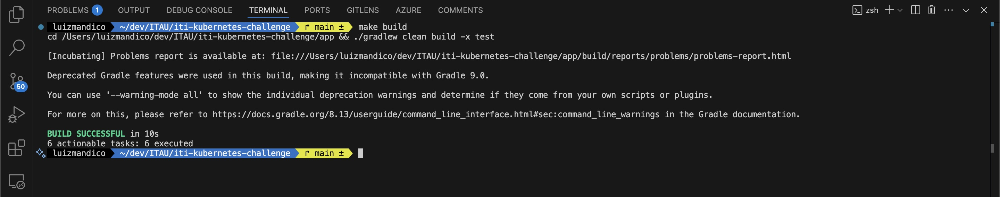
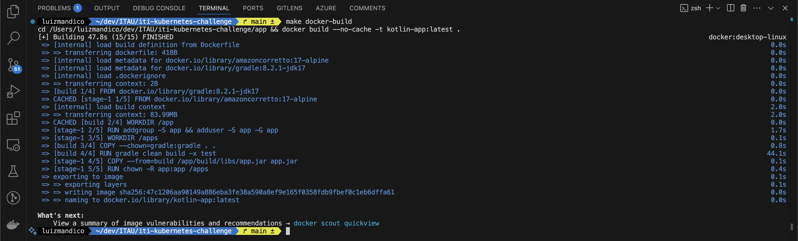
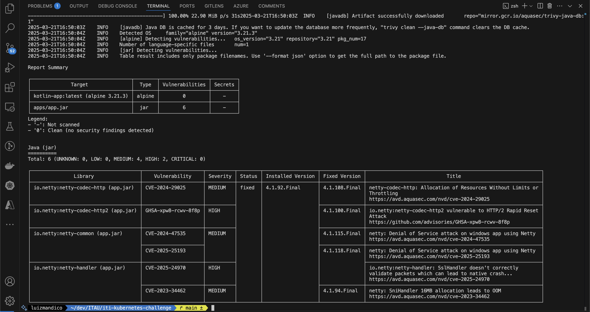
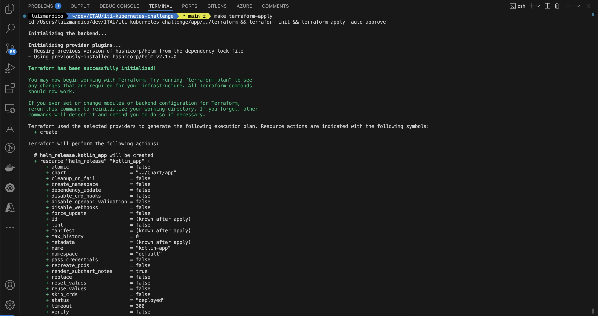
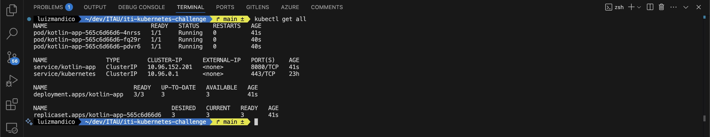
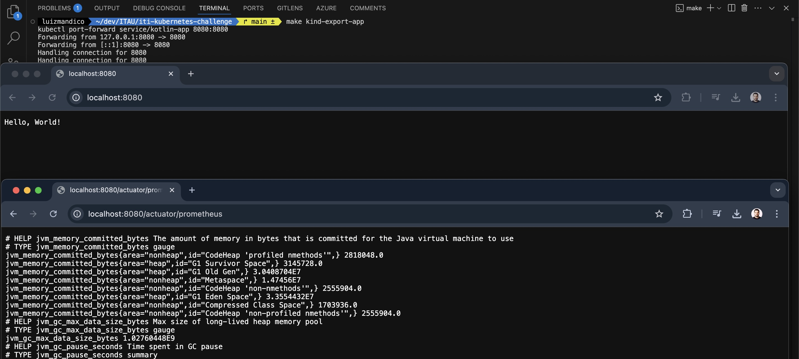
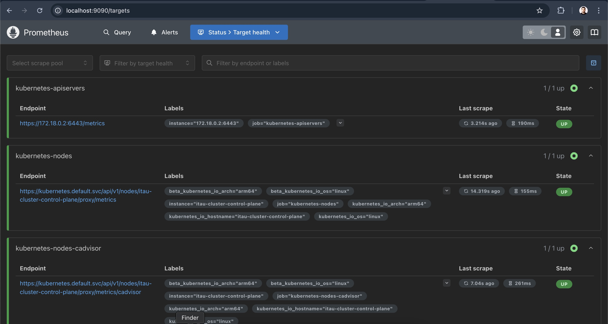
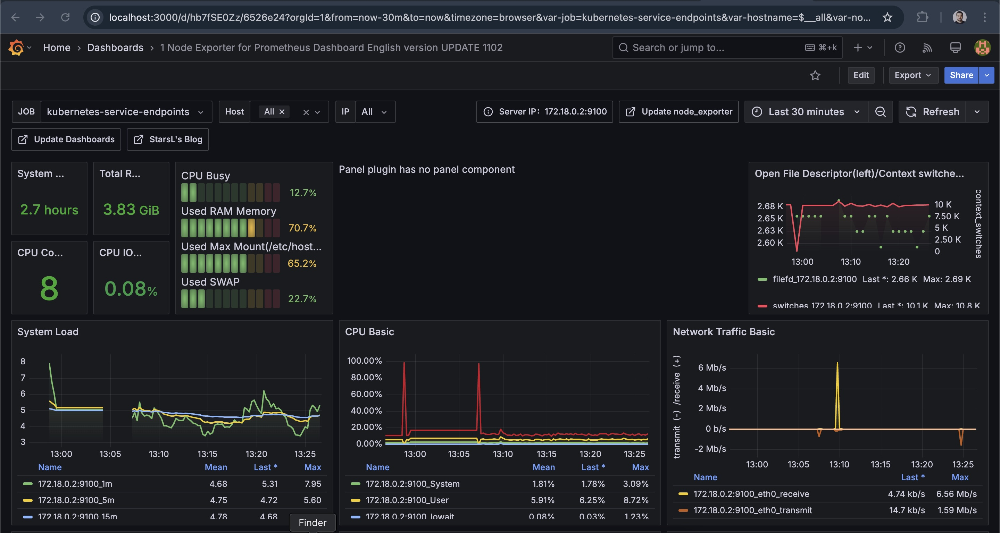

<p align="center">

</p>

# Challenge - Kubernetes
#### Executor: Luiz Mandico (luizmandico@gmail.com)
---

Este repositório contém a solução para o desafio de Kubernetes, incluindo a aplicação Kotlin, Docker, Kubernetes, Helm Chart e Terraform para deploy no cluster Kubernetes.

---

## **Pré-requisitos**

Pré-requisitos necessário para execução do desafio:

[](https://www.docker.com/)
[](https://kind.sigs.k8s.io/)
[](https://helm.sh/)
[](https://www.terraform.io/)
[](https://kubernetes.io/docs/tasks/tools/)

---

## **Estratégias Avaliadas para Execução**

Abaixo, descrevo os itens levados em consideração para uma melhor execução do exercício e detalho o porque de cada decisão:

* **Aplicação:**
    * Upgrade para uma versão mais recente do Klotin e Java (17), corrigindo vulnerabilidades de segurança.
    * Inclusão de endpoint para expor as métricas para o Prometheus.
* **Container:**
    * Build Docker em multistage para ter uma imagem  mais enxuta.
    * Adoção de boas práticas no Dockerfile, como o não uso do usuário root. 
* **Makefile:**
    * Criacao de um Makefile para dar agilidade e celeridade nos testes para construção e destruição do ambiente.
* **Helm Chart:**
    * Criação do Helm Chart com boas práticas de construção de manifestos (readnessProbe, livenessProbe, resource request, resource limit).
* **Terraform:**
    * Criação de estrutura enxuta para deploy da aplicação.
* **Observabilidade:**
    * Análise da perspectiva da infraestrutura e da perspectiva da aplicação.

--- 

## **Passos para Execução**

### **1. Build da Aplicação**
<details>
<summary>1.1 Build da Aplicação Local</summary>

1. Compile a aplicação Kotlin utilizando o Gradle, localmente:
   ```bash
   make build
   ```

2. Resultado:

</details>

<details>
<summary>1.2 Build da Aplicação Container</summary>

1. Compile a aplicação Kotlin utilizando o Gradle com Docker em multistage:
   ```bash
   make docker-build
   ```

2. Resultado:

</details>

<details>
<summary>1.3 Scan Vulnerabilidades Container</summary>

1. Scan da Imagem usando trivy:
   ```bash
   make docker-scan
   ```

2. Resultado:

</details>

### **2. Deploy no Cluster Kubernetes**
<details>
<summary>2.1 Criar Cluster com Kind</summary>

1. Crie o cluster Kubernetes Local:
    ```bash
    make kind-create-cluster
    ```
2. Carregue a imagem Docker no Cluster Kind:
    ```bash
    make kind-load-image
    ```
</details>

<details>
<summary>2.2 Deploy via Helm Chart</summary>

1. Instale o Helm Chart no Cluster:
    ```bash
    make helm-install
    ```
2. Validar a criação dos recursos:
    ```bash
    kubectl get all
    ```
3. Exposição dos recursos localmente:
    ```bash
    make kind-export-app
    ```   
4. Acessar e validar a aplicação via browser:
    ```bash
    http://localhost:8080/
    ```
5. Desinstalar o Helm Chart do Cluster:
    ```bash
    make helm-uninstall
    ```
</details>

<details>
<summary>2.3 Deploy via Terraform</summary>

1. Instale o Helm Chart no Cluster via Terraform:
    ```bash
    make terraform-apply
    ```
    
2. Validar a criação dos recursos:
    ```bash
    kubectl get all
    ```
    
    
3. Exposição dos recursos localmente:
    ```bash
    make kind-export-app
    ```
    
4. Acessar e validar a aplicação via browser:
    ```bash
    http://localhost:8080/
    ```
    
    
5. Desinstalar o Helm Chart no Cluster via Terraform:
    ```bash
    make terraform-destroy
    ```
</details>

### **3. Observabilidade**
<details>
<summary>3.1 Instalação do Prometheus</summary>

1. Instalação do Prometheus:
    ```bash
    make prometheus-install
    ```
2. Exposição do Prometheus:
    ```bash
    make prometheus-access
    ```
3. Acesso via browser:

</details>

<details>
<summary>3.2 Instalação do Grafana</summary>

1. Instalação do Grafana:
    ```bash
    make grafana-install
    ```
2. Exposição do Grafana:
    ```bash
    make grafana-access
    ```
3. Acesso via browser:

</details>

---

## **Implementações a serem consideradas**

Abaixo, descrevo algumas implementações que não foram aplicadas neste exercício, mas tem sua necessidade de execução em um cenário real.

* **Kubernetes - Nodes Multizone:**
    * Para trazer maior disponibilidade e resiliencia, aconselha-se a que o orquestrador de containers tenha seus nodes distribuidos entre as Zonas do Cloud Provider.
* **Kubernetes - Affinity / Anti-Affinity:**
    * Para tirar um maior proveito dos nodes em multizone, se faz necessário implementar regras de Affinity & Anti-Affinity para que as replicas dos componentes não sejam agendadas no mesmo node.
* **Kubernetes - HPA**
    * Para um melhor desempenho e experiencia do usuário, faz sentido refinar o scale dos componentes com HPA ou KEDA, deste modo, atendendo as sazonalidades do uso da aplicação.